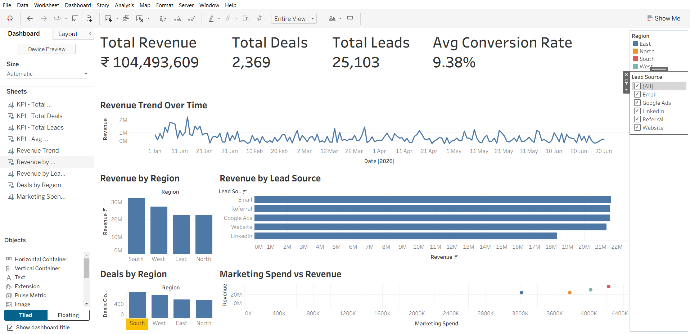

# AI-Powered Sales Performance Dashboard

---
## Project Overview

This project analyzes sales performance data using PostgreSQL and visualizes key business insights with Tableau.

The dashboard helps monitor revenue, sales performance, lead generation, marketing efficiency, and conversion rates through interactive visualizations.

---

## Tools Used

- PostgreSQL
- SQL
- Tableau Public
- Microsoft Excel

---

## Dataset

The dataset contains sales information including:

- Date
- Region
- Lead Source
- Leads Generated
- Demo Calls
- Deals Closed
- Revenue
- Marketing Spend
- Sales Hours Spent
- Conversion Rate
- Win Rate
- Revenue per Lead
- Cost per Lead
- Cost per Acquisition

---

## SQL Analysis

The SQL script includes:

- Total Revenue
- Total Deals Closed
- Total Leads Generated
- Average Conversion Rate
- Revenue by Region
- Revenue by Lead Source
- Deals by Region
- Marketing Spend Analysis

---

## Dashboard

### KPIs

- Total Revenue
- Total Deals
- Total Leads
- Average Conversion Rate

### Visualizations

- Revenue Trend Over Time
- Revenue by Region
- Revenue by Lead Source
- Deals by Region
- Marketing Spend vs Revenue

### Interactive Filters

- Region
- Lead Source

---
## Dashboard preview

---

## Project Structure

AI-Powered-Sales-Performance-Dashboard/

│

├── data/

├── sql/

├── dashboard/

├── images/

└── README.md

## Author
Tanishka Durande
